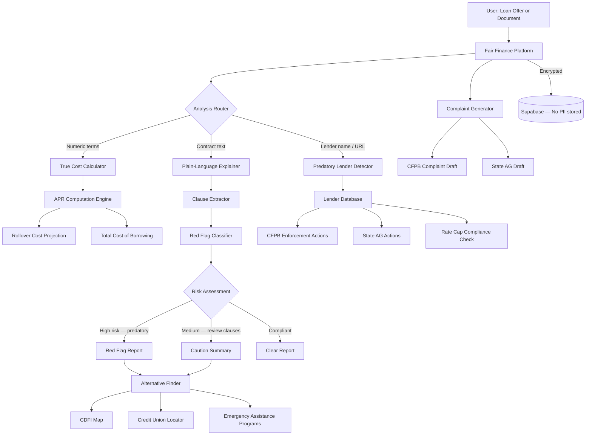

<p align="center">
  <h1 align="center">foundation-fair-finance</h1>
  <h3 align="center"><em>Predatory lending detector. Payday loan true-cost calculator. $9B in fees extracted annually.</em></h3>
</p>

<p align="center">
  <a href="LICENSE"></a>
  
  
  <a href="https://mama.oliwoods.ai"></a>
  <a href="https://mama.oliwoods.ai/foundation"></a>
</p>

---

> **"The payday lending industry extracts $9.8 billion in fees from borrowers annually — the majority of whom are trying to cover basic expenses like rent and groceries. The average borrower takes out 8 loans per year and pays $520 in fees to borrow $375."**
> — CFPB Payday Loan Market Research, 2023
>
> *The debt trap is not a bug. It is the business model. We built the decoder.*

## Why This Exists

- **APRs are deliberately obscured.** The average payday loan carries an APR of 391%. Lenders are required to disclose APR but present it alongside confusing "fee per $100 borrowed" framing designed to minimize perception of cost ([CFPB, 2023](https://www.consumerfinance.gov/))
- **The trap is mathematically designed.** 80% of payday loans are rolled over or renewed within 14 days. A single $300 loan rolled over 8 times costs the borrower $720 in fees — and the principal remains unpaid ([Pew Charitable Trusts, 2022](https://www.pewtrusts.org/))
- **Rent-a-bank schemes evade state caps.** 18 states have capped payday loan APRs at 36% or below. Lenders have responded by partnering with out-of-state banks to export higher-APR products — stripping state consumer protections ([National Consumer Law Center, 2023](https://www.nclc.org/))
- **Racial and geographic targeting is documented.** Payday loan storefronts and digital lenders are concentrated in Black, Latino, and low-income communities at rates 8–12× higher than in wealthy neighborhoods, controlling for population density ([NCRC, 2022](https://ncrc.org/))

## What Fair Finance Does

| Capability | Description |
|---|---|
| **True Cost Calculator** | Converts any loan offer into annualized APR, total cost of borrowing, and roll-over cost projection |
| **Predatory Lender Detector** | Analyzes loan agreements for 40+ red-flag clauses: mandatory arbitration, automatic renewal, balloon payments, obscured fees |
| **Contract Plain-Language Explainer** | Uploads any loan document and returns a plain-English summary of every clause that costs money |
| **Rate Cap Checker** | Determines whether a specific loan offer violates state usury laws or CFPB small-dollar lending rules |
| **Alternative Finder** | Surfaces credit unions, CDFIs, employer advance programs, and LIHEAP/SNAP alternatives for the specific need |
| **Complaint Generator** | Drafts CFPB and state AG complaints with pre-populated case details from loan documents |
| **Debt Trap Tracker** | Visualizes rollover cycles, cumulative fees paid, and break-even analysis for existing payday debt |
| **Community Lender Map** | Locates CDFI and credit union alternatives by ZIP with loan product comparison |

## System Architecture



## Why This Is the Best Tool on the Market

The CFPB's complaint portal and state AG offices process complaints reactively, after harm is done. Financial literacy apps teach budgeting but do not analyze contracts or surface predatory clauses. No free tool exists that combines contract analysis, true-cost computation, legal violation detection, and alternative sourcing in one place.

**We built this so that anyone handed a loan offer can know exactly what they are signing before they sign it.**

### vs. Commercial Alternatives

| Feature | foundation-fair-finance | Commercial Alt. |
|---------|---------|-----------------|
| Price | **Free forever** | Credit counseling: $50–200/session |
| True APR Calculator | **Yes** | Calculator.net (no contract analysis) |
| Contract Clause Analyzer | **Yes** | Legal review: $200–500 |
| Rate Cap Compliance Check | **Yes** | No |
| Predatory Lender Database | **Yes** | No |
| Complaint Auto-Draft | **Yes** | No |
| Open Source | **Yes** | No |

## Research & Citations

- CFPB (2023). *Payday Loans and Deposit Advance Products Market Report*. [consumerfinance.gov](https://www.consumerfinance.gov/data-research/research-reports/payday-loans-and-deposit-advance-products/)
- Pew Charitable Trusts (2022). *Payday Lending in America*. [pewtrusts.org](https://www.pewtrusts.org/en/research-and-analysis/reports/2012/04/payday-lending-in-america)
- National Consumer Law Center (2023). *Rent-a-Bank Schemes*. [nclc.org](https://www.nclc.org/resources/rent-a-bank-schemes/)
- National Community Reinvestment Coalition (2022). *Predatory Lending and Geographic Targeting*. [ncrc.org](https://ncrc.org/)
- Federal Reserve (2023). *Report on the Economic Well-Being of U.S. Households*. [federalreserve.gov/publications/2023-economic-well-being-of-us-households](https://www.federalreserve.gov/publications/2023-economic-well-being-of-us-households-in-2022.htm)

## Quick Start

```bash
git clone https://github.com/OliWoods-Org/foundation-fair-finance.git
cd foundation-fair-finance
npm install
npm run dev
```

## Tech Stack

- **Runtime:** Node.js + TypeScript
- **Validation:** Zod schemas
- **Database:** Supabase (PostgreSQL, no PII storage architecture)
- **AI:** Claude API for contract analysis and plain-language generation
- **Geo:** Mapbox for CDFI and credit union mapping
- **Integrations:** CFPB API, NCUA credit union locator, FDIC CDFI database

## Contributing

We welcome contributions from consumer finance advocates, legal aid technologists, and data journalists.

1. Fork the repo
2. Create a feature branch (`git checkout -b feat/your-feature`)
3. Commit your changes
4. Push and open a PR

## License

AGPL-3.0 — Free to use, modify, and distribute.

---

<p align="center">
  <strong>Built by the <a href="https://oliwoods.ai">OliWoods Foundation</a></strong><br>
  <em>Free forever. Open source. Financial clarity should not be a luxury.</em>
</p>
